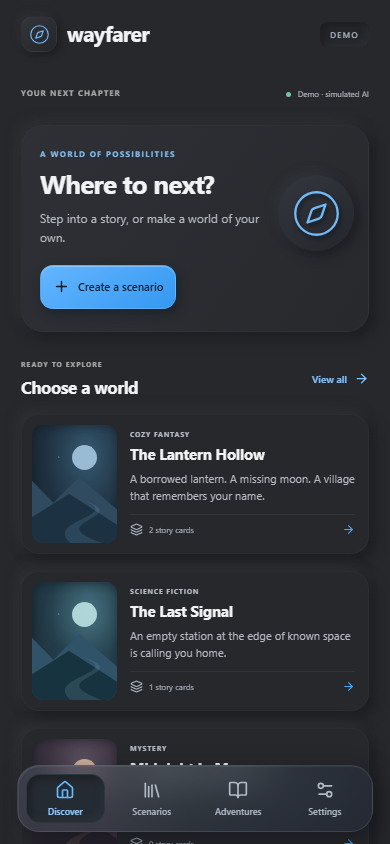
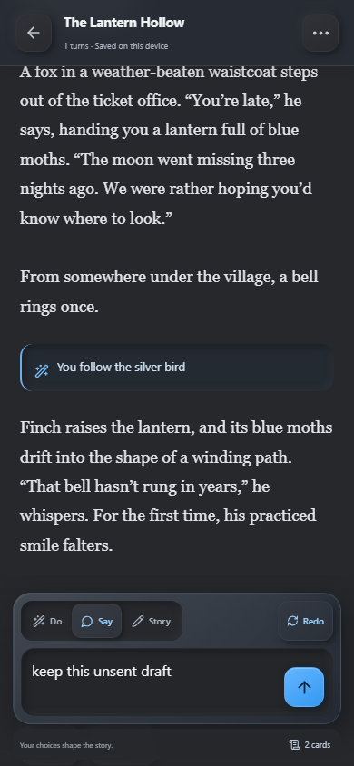
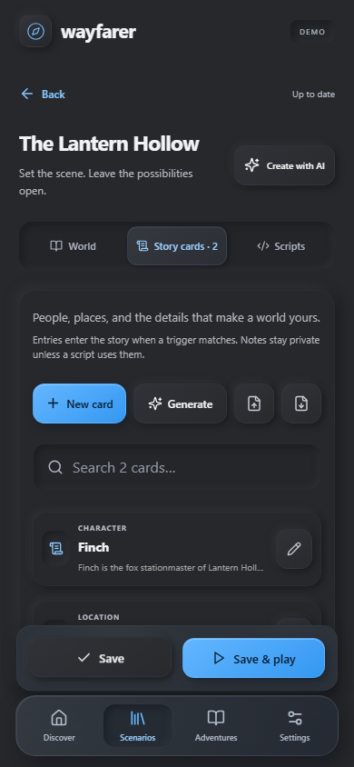

# Wayfarer for Layla

Create worlds, play AI-powered text adventures, and keep your stories on your device.

Wayfarer is a mobile-first mini app for **Layla**, with a charcoal-and-blue interface that blends soft raised surfaces with frosted glass controls.

## A look inside

  
  
  

Screenshots use the included sample world and development demo. Actual story responses come from your configured Layla model.

## What you can do

- **Build a world.** Write a scenario yourself or generate a draft with AI, then review and edit it.
- **Play your way.** Use **Do**, **Say**, or **Story**. Press the arrow with an empty box to continue; **Redo** regenerates the latest turn while keeping your unsent draft.
- **Shape the narration.** Built-in guidance asks the model to avoid repetition, invented player actions or dialogue, option lists, and closing “What do you do?” questions. Results depend on the loaded model.
- **Keep track of your lore.** Create story cards for characters and places, import/export AI Dungeon card JSON, and preserve private notes and extra fields.
- **Add scripts.** Use the included Inner Self and Auto-Cards presets or edit your own Input, Context, and Output hooks.
- **Keep your progress.** Resume separate adventures, edit or undo the latest passage, export backups, and optionally link lore and facts to Layla memory.

## Download and install

1. Download **wayfarer-1.1.2.zip** from this repository's **Releases** section. Use the attached app ZIP, rather than GitHub's automatically generated source archive.
2. Copy it to your Android phone.
3. In Layla, open **Apps → + → Import → Zip File**, select the ZIP, and import it.
4. Return to the main **Apps** list, open **Wayfarer**, and begin an adventure.

For an update, export a backup first, import over the existing Wayfarer app, then fully restart Layla before reopening it. This avoids a stale database connection observed on Layla 7.4.

Generation uses Layla's configured model. Wayfarer requires no separate API key. Tested with **Layla 7.4.0 Direct on Android**; a normal browser supports editing and local saves but requires Layla for real generation.

## More

- [Development and usage guide](docs/DEVELOPMENT.md)
- [Script compatibility](COMPATIBILITY.md)
- [Validation notes](VALIDATION.md)
- [Third-party credits and licenses](THIRD_PARTY_NOTICES.md)

The app stores its library in Layla's private mini-app database. Export backups before uninstalling or clearing data. If Layla is configured to use a remote model, generation follows that host configuration.
