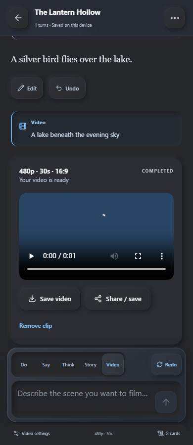

# Wayfarer for Layla

Create worlds, play AI-powered text adventures, and keep your stories on your device.

Wayfarer is a mobile-first mini app for **Layla**, with an optional **Wayfarer PC Companion** for local video generation.

## A look inside

  
  
  
  

## What you can do

- **Build a world.** Write a scenario yourself or generate a draft with AI, then review and edit it.
- **Play your way.** Use **Do**, audible **Say**, private **Think**, or **Story**. Press the arrow with an empty box to continue; **Redo** regenerates the latest turn while keeping your unsent draft.
- **Watch the story unfold.** Ordinary turns stream as Layla writes. If your model provides thinking, open **Show thinking** to read it separately. Scripts that process model output buffer it so private NPC and card work stays hidden.
- **Read at your own pace.** Scroll back without new text pulling you down. A floating down-arrow fades in whenever you are above the latest passage, including while scrolling; tap it to return to the latest passage and follow new text.
- **Shape the narration.** Built-in guidance asks the model to avoid repetition, invented player actions or dialogue, option lists, and closing “What do you do?” questions. NPC knowledge is limited by instructions to established observations and sources; private thoughts stay labeled as private. A style instruction avoids the descriptor “ozone.” Results depend on the loaded model; no extra generation pass is added.
- **Keep track of your lore.** Create story cards for characters and places, import/export AI Dungeon card JSON, and preserve private notes and extra fields.
- **Add scripts.** Use the included Inner Self and Auto-Cards presets or edit your own Input, Context, and Output hooks.
- **Bring scenes to life.** Select **Video** beside Do/Say/Think/Story, write a scene, and press **Send**. Progress and the generated video appear alongside your story. **Video settings** stays at the bottom left, with an **Adventure videos** section for viewing, saving and deleting clips. Optional AI enhancement, AI-chosen length or 1–225 seconds, 480p/720p, video style, public story context and a starting image are available. Videos over 15 seconds use sequential generated segments with last-frame guidance.
- **Keep your progress.** Resume separate adventures, edit or undo the latest passage, export backups, and optionally link lore and facts to Layla memory.

## Download and install

Download both apps from [Wayfarer 1.4.1 Releases](https://github.com/Darker117/wayfarer-layla/releases/tag/v1.4.1):

| Download | Install on | Purpose |
| --- | --- | --- |
| [Wayfarer mini-app](https://github.com/Darker117/wayfarer-layla/releases/download/v1.4.1/wayfarer-1.4.1.zip) | Android phone, inside Layla | Create and play stories; send scenes for video generation. |
| [Wayfarer PC Companion](https://github.com/Darker117/wayfarer-layla/releases/download/v1.4.1/wayfarer-pc-companion-1.4.1.zip) | Windows PC | Connect Wayfarer to your existing ComfyUI setup and manage connection codes. |

For the PC Companion, extract the ZIP and double-click **Start-Wayfarer-PC-Companion.cmd**. Its browser page creates reusable codes for **10, 20, or 30 minutes**, or **Forever**, and lets you delete them. See [companion setup](gateway/README.md) for required runtimes and models, then [phone connection instructions](docs/VIDEO.md). It uses your existing ComfyUI installation; model weights are not bundled.

### Install the Layla mini-app

1. Download the attached app ZIP from this repository's **Releases** section.
2. Copy it to your Android phone.
3. In Layla, open **Apps → + → Import → Zip File**, select the ZIP, and import it.
4. Return to the main **Apps** list, open **Wayfarer**, and begin an adventure.

For an update, export a backup first, import over the existing Wayfarer app, then fully restart Layla before reopening it.

### If the library cannot be opened

Layla 7.4 can keep a failed native database connection alive, including during ordinary use. If Wayfarer says **Layla needs a full restart**, open **Android Settings → Apps → Layla → Force stop**, then launch Layla and open Wayfarer. Use **Force stop**, keeping the app's storage and data. Reloading the mini app alone may repeat the error. This recovered the current library in device testing; the underlying connection lifecycle needs a Layla host fix.

Generation uses Layla's configured model. Wayfarer requires no separate API key. Tested with **Layla 7.4.0 Direct on Android**

## More

- [Local video setup and operation](docs/VIDEO.md)
- [Wayfarer PC Companion](gateway/README.md)
- [Development and usage guide](docs/DEVELOPMENT.md)
- [Script compatibility](COMPATIBILITY.md)
- [Validation notes](VALIDATION.md)
- [Third-party credits and licenses](THIRD_PARTY_NOTICES.md)

The app stores its library in Layla's private mini-app database. Export backups before uninstalling or clearing data. If Layla is configured to use a remote model, generation follows that host configuration.
