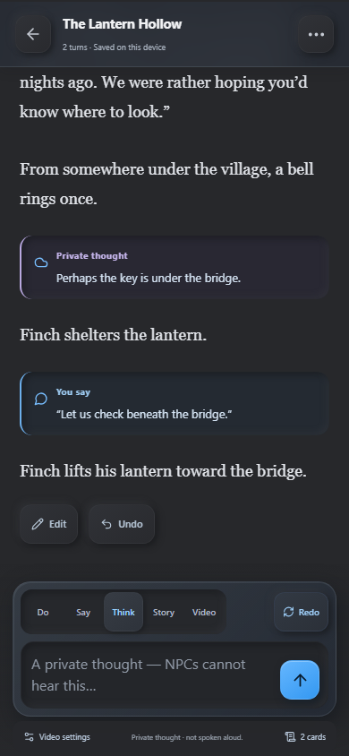
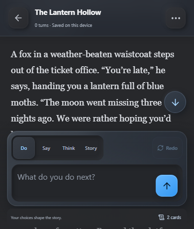

# Wayfarer for Layla

A mobile-first text-adventure studio: create reusable worlds, play with your local Layla model, and keep the story on your device.

## Import on Android

1. Copy `release/wayfarer-1.3.0.zip` to the phone's Downloads folder.
2. In Layla, open **Apps → + → Import → Zip File** and choose the ZIP.
3. Return to **Apps**, search **Wayfarer**, and open its tile. The Browse Apps page can keep showing an Add button after a custom ZIP import on 7.4; launch from the main Apps list. Choose a scenario, then **Begin adventure**.
4. Write a **Do**, **Say**, **Think**, or **Story** action, or press the send arrow with an empty box to **continue**. Layla uses its currently configured model. No API key is required.

Built for **Layla 7.4.0 Direct**. The pinned SDK 7.5.2 automatically uses the older host protocol; this app does not depend on native model tool calling.

## Database startup and recovery

Wayfarer loads its library through the SDK's private SQLite API. Only a successful read with no rows creates a new library; malformed results, invalid saved JSON, and native failures stop startup without writing a replacement. Writes require exactly one confirmed affected row. Concurrent operations share schema initialization; a rejected initialization can be attempted again, and failed writes are not automatically replayed.

The Android error `NativeDatabase.execAsync` with `java.lang.NullPointerException` occurs inside Layla's native database connection setup. The 7.4 host caches its database-opening promise; page reloads do not necessarily create a fresh native connection. The public SDK exposes SQL execution but no connection reset/open/close API. Wayfarer reports the error with **Android Settings → Apps → Layla → Force stop** recovery steps and retains the original error in **Error details**. This patch does not repair the host's native handle.

Testing reproduced the failure without importing a new ZIP in that session. A full process restart recovered the existing library; ordinary exit/reopen subsequently succeeded. The exact earlier event that invalidated the handle is unconfirmed. A similar Android native-handle failure is documented in [Expo issue #48999](https://github.com/expo/expo/issues/48999); its underlying mechanism has not been established for this Layla build.

Storage regression tests cover rejected startup, recovery, malformed rows, confirmed writes, and initialization concurrency. Browser tests use the real SDK with a controlled host bridge to verify failure guidance, no browser-storage fallback, and loading the unchanged library after simulated host recovery.

## Using Wayfarer

- **Discover**: sample worlds and your most recent adventure.
- **Scenarios**: create or edit a reusable template, generate a draft with AI, manage cards, and attach scripts. AI drafts are reviewed before saving.
- **Adventures**: resume, archive, restore, or delete a playthrough. Every new adventure gets independent cards, scripts, and state; later template edits do not change existing adventures.
- **Narrator rules**: new and AI-generated scenarios include instructions against repetition, invented player actions or dialogue, choice lists, and closing narrator questions. These rules also accompany generation in existing adventures without rewriting saved world data. Model adherence still depends on the loaded model.
- **Play**: streamed prose when scripts are off; scripted output appears after the Output hook. Cancel leaves the last saved state intact. **Redo** beside Do/Say/Think/Story resends the latest turn’s original action and replaces its response from a checkpoint. It preserves any unsent draft and is disabled before the first turn or while generating. Undo restores cards, script state, and adventure facts together. Edit adjusts the latest visible passage; with scripts, use Undo for a full state rollback.
- **Adventure menu → Story cards**: edit exact entries/notes or import an AI Dungeon card JSON export. Import supports keeping all copies, skipping completely identical objects, or replacing matching title + triggers. Different notes are never treated as an identical duplicate. Export retains unknown fields and both character-creation flag spellings. The flag is preserved for round trips; this release has no character-creation questionnaire.
- **Adventure menu → Adventure memory**: write exact facts for context. Optionally select a Layla character and sync lore/facts into built-in memory. Sync is manual; sync again after Undo or edits. Native recall prioritizes matching current card entries within your context budget. Private storage remains authoritative. Ordinary card notes and script brains are never mirrored. Unlinking does not delete host memories.
- **Settings → Export backup**: includes scenarios, adventures, scripts, cards, and turn checkpoints. Restore adds independent copies and clears imported host-memory bindings. A story-card export alone does not contain scripts or the entire scenario.

## Private thoughts and NPC perspective

**Say** is spoken dialogue; **Think** is the player's private thought. The composer explains the selected mode and saved history labels each distinctly. Think is saved as its own mode through replay, Redo, Undo, transcript exports and backups. It is unrelated to the model's optional **Show thinking** panel.

Narrator instructions limit each NPC to witnessed, heard, disclosed or otherwise established knowledge. World lore, plot essentials and adventure facts are labeled as narrator reference, not common NPC knowledge. Private player thoughts receive explicit boundaries even when old context is shortened. Instructions preserve source, uncertainty and privacy in summaries and lore; explicit dialogue or an established in-world ability may reveal a fact.

The shared prose guidance asks the model never to use “ozone” as a generated descriptor. It accompanies ordinary turns, Redo, script narrative requests and scenario/card JSON drafting. Per the chosen instruction-only approach, there is no output filter, phrase substitution, automatic retry, added model call, or NPC knowledge database. The model can still disregard instructions, including during streaming. JSON, authored text, existing cards, scripts and saved state are never rewritten to enforce this preference. New generated scenarios retain these rules alongside their custom style; existing saved instructions remain untouched.

Wayfarer does not summarize turns automatically or mirror them to Layla memory. Only enabled card entries and explicitly saved adventure facts are mirrored verbatim, including existing privacy/uncertainty labels. If you manually place a private thought into facts or lore, identify whose knowledge it represents. Scripts retain their own memory behavior and may replace context; see [compatibility](../COMPATIBILITY.md).

<p> </p>

## Live answers and optional thinking

With scripts off, the answer updates as Layla sends text. **Show thinking** appears only when the model supplies reasoning through the SDK's separate reasoning channel. It starts collapsed and can be toggled while generation is running. Not all models provide this channel. Wayfarer does not invent thinking or infer it from ordinary prose.

Scrolling upward pauses following. A floating down-arrow fades in above the composer whenever the latest text is below view, including during active scrolling. It hides near the end. Tapping returns to the latest text and resumes following streamed content. Reduced-motion preferences skip the smooth scroll; composer and visual-viewport measurements keep the control above the input area.

Thinking is temporary: it is available for the latest completed turn until you start another turn, undo it, or leave the story. It is never written into saved turns, backups, story context, cards, or Layla memory. Redo starts with fresh, collapsed thinking. Cancel and errors discard both partial channels and preserve the saved adventure.

Input/Context-only scripts can finish their work and then stream both public channels when their Library and Output source are empty. Otherwise, both channels are buffered until the Output hook finishes. Inner Self, Auto-Cards, and custom hooks may consume private model output, transform it, or suppress it entirely. Only the processed story is shown; script-managed thinking is not exposed.

The existing bundled-script workflow is retained by choice; no separate private/public model passes are added. See [streaming investigation](STREAMING.md) for the upstream constraints, accepted behavior, and pending native verification.

The pinned SDK handles standard `<think>…</think>` blocks, including split marker chunks. Wayfarer uses its content/reasoning events and final completion fields without another parser. Non-protocol or malformed markers follow SDK behavior. An unclosed thinking block has no final answer and the turn is not saved.

## Scripts

See [COMPATIBILITY.md](../COMPATIBILITY.md) for the exact supported environment and limits. **Inner Self** and **Auto-Cards** by LewdLeah are included as editable presets with licenses. Load a preset in the scenario's Scripts tab and save. After the first turn, edit its configuration card. Prefix an NPC title with `@` (such as `@Finch`) to nominate it for Inner Self. Standalone Auto-Cards defaults to off; its configuration card or `/AC` enables it.

## Local development

Requires Node.js 22+.

```sh
npm ci
npm run dev
npm test
npm run test:ui
npm run package
```

First-time browser testing: `npx playwright install chromium`.

- Normal browser mode supports editing and local saves; generation clearly requires Layla.
- Development only: `http://127.0.0.1:5173/?demo=1` installs the official SDK mock with visibly labeled simulated AI. Demo responses are removed by the production build. A demo test proves UI behavior, not native integration.
- `npm run build` emits self-contained `dist/index.html`, including the isolated worker and embedded QuickJS WASM. No CDN or external asset requests are needed.
- `node tools/assets.mjs` regenerates the locally drawn icon and cover. `npm run package` builds and checks the ZIP root and writes a SHA-256 checksum.

## Storage and limits

Inside Layla, atomic snapshots live in the mini app's private SQLite database. A failed native save is surfaced instead of silently switching databases. Browser development uses separate browser storage. Export backups before uninstalling Layla or replacing mini-app data.

After overwriting an installed ZIP, Layla 7.4 can retain a stale database connection and report `NativeDatabase.execAsync` / `NullPointerException`. Fully close and restart Layla, then reopen Wayfarer. This resolved the observed update issue while preserving the adventure, cards, and scripts. Do not clear app data to resolve this error.

If generation stays on “Layla is writing” without any text, check Layla's selected inference model and its connection. In the physical-phone test, a selected remote endpoint did not return text; an installed local model generated normally. A response cut off mid-sentence can be continued by pressing the send arrow with an empty box; generation length is controlled by the host on Layla 7.4.

Version 1.1 blends neumorphism and glassmorphism: softly raised charcoal surfaces, inset fields, blue selected states, and translucent frosted navigation, dialogs, and story controls. Compact mobile layouts and a sculpted compass icon complete the design. The glass layers use real backdrop blur with an opaque fallback for older WebViews. The palette complements Layla’s charcoal and blue theme. Colors are bundled, not dynamically linked to future Layla theme changes.

Card import: 10 MB / 3,000 cards. Backup restore: 50 MB. Script source: 2 MB per executed Library + hook. Script payload/result: 10 MB. Very large adventures with many cards consume more space because turn checkpoints preserve exact state.

## Project structure

- `src/domain.ts`, `cards.ts`, `context.ts`, `engine.ts`: data and turn processing.
- `src/storage.ts`, `backup.ts`, `host.ts`: persistence, validation, SDK and memory ownership.
- `src/scripts/`: QuickJS sandbox, worker isolation, upstream presets.
- `src/vendor/`: unchanged upstream script sources and licenses.
- `tests/`, `e2e/`: core/compatibility and browser integration tests.
- `artifacts/`: screenshots and validation evidence.
- `release/`: importable ZIP and checksum.

Test coverage and device findings are summarized in [Validation](../VALIDATION.md). Private device evidence is excluded from the repository.
# Optional video development

Wayfarer 1.5 uses `src/comfy.ts` for direct ComfyUI requests, `src/comfyWorkflow.ts` for the native multi-segment workflow, and `src/VideoPanel.tsx` / `src/VideoClip.tsx` for composer settings and playback. `src/workflows/hermes-fasth3.json` preserves the working model/sampler configuration. `npm test` and `npm run test:ui` exercise transport recovery, ownership and the UI. `npm run test:comfy-direct` is an opt-in native synthetic 225-second smoke against a running idle ComfyUI; add `-- --render` to explicitly test a neutral five-second model generation. The old `gateway/` source and tests are retained for 1.4 installations only and are not packaged. Full direct-connection setup, Tailscale, generation boundaries and storage behavior are described in [VIDEO.md](VIDEO.md). No model weights or private media are packaged.
